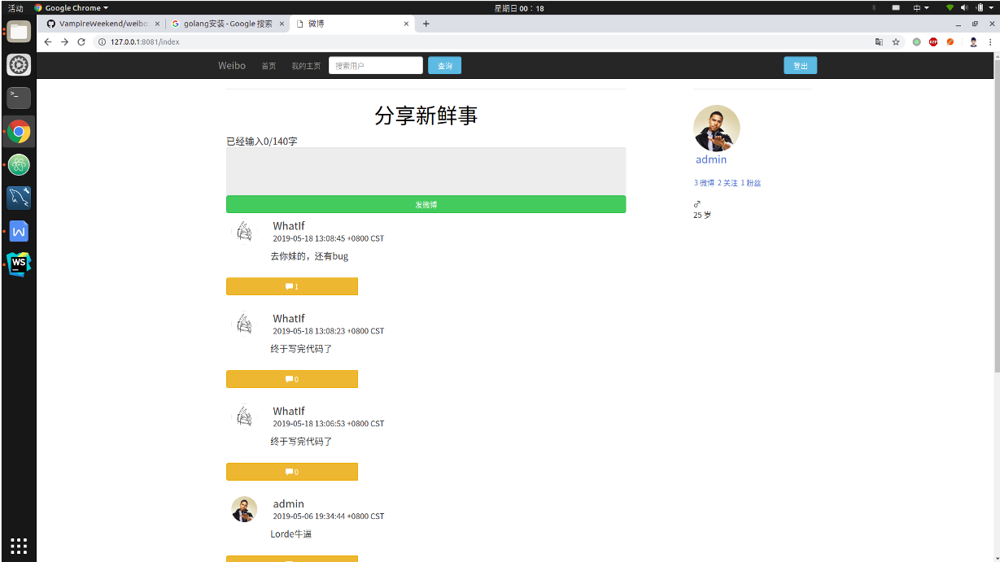

# UESTC System Level Comprehensive Software Design Course Project

## Project Requirement

To implement a simple Weibo platform. The features of the Weibo platform include:

(1) User authentication system.

(2) The user can publish tweets of no more than 139 words.

(3) Users can follow and unfollow other users.

(4) Users can add comments to tweets (no more than 100 words).

(5) Users can view the tweets posted by followed users and him/herself at homepage.

## Tech Stack and Dev Environment

Front-end framework: Bootstrap, jQuery

Front-end development environment: IntelliJ Webstorm

Backend: Implemented with Golang and use Gin & Gorm frameworks. Gin is the web framework, and Gorm is the Golang version of database object-relational mapping

Database: MySQL 5.5

## Project structure

```
-weibo
    |-controllers
    |-images
    |-models
    |-resources
    |-static
        |-css
        |-fonts
        |-js
        |-pic
    |-views
    |-main.go
```

## Run the project locally

The following operations are done in a Unix-like operating system.

Before running the project, please configure the database first.

1. Run the file `/resources/weibo.sql`
2. On line 59 of `models/models.go` in the project, change the database configuration information in the following code to your own configs.

```go
db, err := gorm.Open("mysql", "debian-sys-maint:#VictorOladipo#@tcp(127.0.0.1:3306)/weibo?charset=utf8&parseTime=True&loc=Local")
//     (username):(password)@(connection_address)/weibo?charset=utf8&parseTime=True&loc=Local")
```


Run the background service afterwards.

1. First install the Go language, after decompressing the Golang package, please set the environment variable `GOPATH`.

You can use `go env GOPATH` to view the current `GOPATH`:

```shell script
go env GOPATH
```

2. `cd` to GOPATH, put this project into `GOPATH/src/github.com/ZhangYW18`

```shell script
go get -u github.com/ZhangYW18/weibo
cd $GOPATH/src/github.com/ZhangYW18/weibo
go get -d -v ./...
```

3. Change the path parameter on line 17, 18 of `main.go` to the local path in the project root directory

```Go
router.Static("/static", "YOUR GOPATH/src/github.com/ZhangYW18/weibo/static")
router.LoadHTMLGlob("YOUR GOPATH/src/github.com/ZhangYW18/weibo/views/**/*")
```

In addition, at the penultimate line of `main.go`, you can set the port number for the project to run locally:

```go
router.Run(":8087")   // 8087 port in default
```

4. `cd` to the project root directory, run the command `go run main.go`, you can enter the login page at 127.0.0.1:8087

## Project Example


